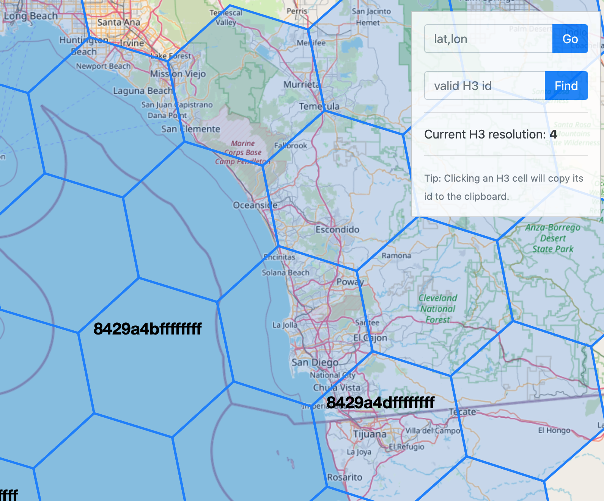
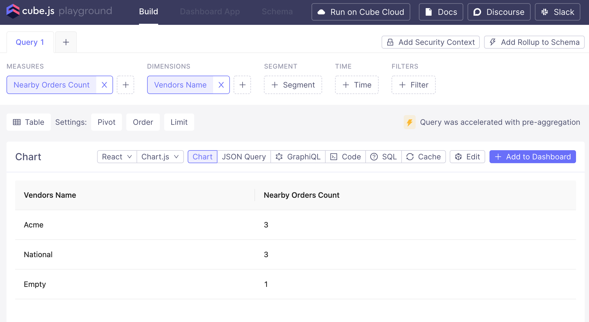
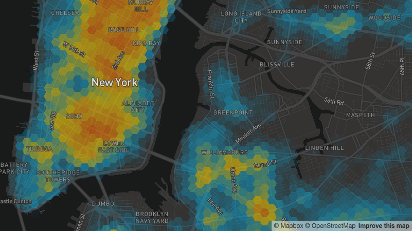
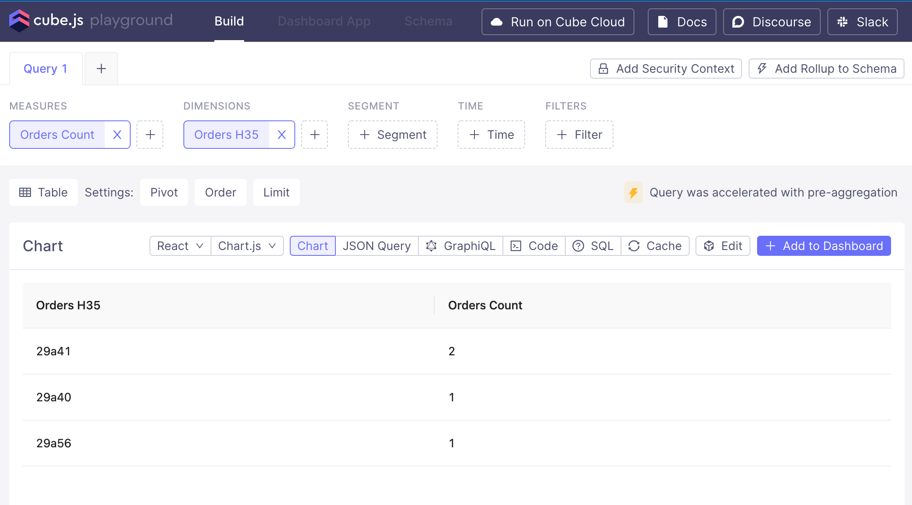
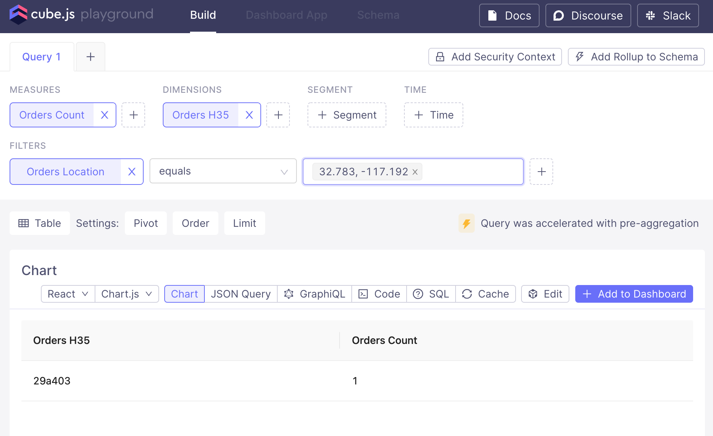

# Cube.js Geo-Hash example

This is a Cube.js example with Geographic data. This post is designed for Intermediate to Advanced users of Cube.js.
In this example I'm using [H3](https://github.com/uber/h3) geographic hashing algorithm, 
although any other hashing algorithm can be used. (e.g. [Geohash](https://en.wikipedia.org/wiki/Geohash))
The objective is to showcase how Cube.js can perform pre-aggregations from joins using H3.

## Data setup

In the `structure.sql` file I'm creating a table for orders and vendors.
Then I'm adding coordinates and H3 hashes (resolution 9) to every order and vendor.
```sql
insert into vendors (tenant_id,vendor_id, name, credit_limit, lat, lon, h3_9) values
  (1, 1, 'Acme', 10230, 32.743249, -117.189582, '29a411a2b')
, (1, 2, 'National', 456.12, 32.671550, -117.114431, '29a41a58b')  -- this vendor will have no orders
, (1, 3, 'Empty', 101.01, 33.758991, -118.245725, '29a560687')
on conflict do nothing;

insert into orders (tenant_id, order_id, vendor_id, title, budgeted_amount, lat, lon, h3_9) values
  (1,1,1,'$100 order w/3li', 100.00, 32.78401236891236, -117.19916781641939, '29a4031db')
, (1,2,1,'$200 order w/1li', 200.00, 32.72343350245376, -117.1304643948471 , '29a41a8d3')
, (1,3,1,'$302 order w/0li', 302.00, 32.71695046609805, -117.16107380616378, '29a41ad8b')
, (1,4,3,'$404 order w/0li', 404.00, 33.82524899050014, -118.02409857821776, '29a56b28f')
on conflict do nothing;
```

Note: I'm storing only the significative characters of the H3 hash.
The H3 hash contains some extra characters at the beginning (`8` followed by the resolution level) 
and at the end (`f` padded until reaching the max character length). 
A typical H3 hash looks like: `83485bfffffffff`. 
By removing extra characters is possible to perform string operations like `contains`.


## Modeling Examples


### Geographical Joins

When we create our schema, in the Orders and Vendors cubes we will need the following dimension:
```javascript
dimensions: {
    ...
    h3_9: {
      sql: `h3_9`,
      type: `string`
    },
    ...
  },
```

Then we can define how we will join both cubes 
by creating a new cube that extends the existing Orders cube:
```javascript
cube(`NearbyOrders`, {
  extends: Orders,
  
  joins: {
    Vendors: {
      sql: `substring(${CUBE}.h3_9, 1, 4) = substring(${Vendors}.h3_9, 1, 4)`,
      relationship: `belongsTo`
    }
  },

  preAggregations: {
    nearbyOrdersByVendor: {
      measures: [NearbyOrders.count],
      dimensions: [Vendors.name]
    }
  },
  
  dataSource: `default`,
});
```
First we define how we are going to join the cubes geographically.
We are "downscaling" the resolution of the hash from 9 to 4, 
to identify which orders are nearby to every Vendor. 
Imagine we would like to know all the possible opportunities for each vendor.
This method is several orders of magnitude faster than [ST_DWithin](https://postgis.net/docs/ST_DWithin.html).
Although, the downside is that we lose accuracy, since we rely on where the coordinates are positioned 
within each hash geometry.




Once we have our schema defined we can verify in the playground that our geographical join is pre-aggregated.
I created 3 orders nearby `Acme` and `National` vendors. And 1 nearby to `Empty` vendor.




### Hexbin Choropleth (a.k.a. Heatmaps)



H3 can be particularly useful when creating Hexbin Choropleths.
Let's say we want to aggregate up to the resolution `5` in H3, 
then we need to create a dimension where we downscale the hash in the Orders cube.
```javascript
dimensions: {
    ...
    h3_5: {
      sql: `substring(${CUBE}.h3_9, 1, 6)`,
      type: `string`
    },
    ...
  },
```

Then we add a pre-aggregation with this dimension:
```javascript
...
  preAggregations: {
    ordersByVendor: {
      measures: [Orders.count],
      dimensions: [Vendors.name]
    },
    ordersByH3: {
      measures: [Orders.count],
      dimensions: [Orders.h3_5]
    }
  },
...
```

Finally, we can verify that this query is pre-aggregated.




### Filters with Lat/Lon to H3 transformations

Let's assume we need to do a fuzzy match between coordinates using H3.
We already have our pre-aggregation using a downscaled H3 dimension, 
but let's say we want to filter the results given a lat/lon coordinate using H3.

First, let's add the `h3-js` library to our `package.json`:
```json
{
  "name": "cubejs-project-template",
  "version": "0.0.1",
  "private": true,
  "scripts": {
    "dev": "cubejs-server"
  },
  "template": "docker",
  "templateVersion": "0.28.19",
  "dependencies": {
    "h3-js": "^3.7.2"
  }
}
```

Then let's add a new dimension `Location` that we are going to use for schema validation of our query, 
but not to do the geographical operation. In our Orders model lets add this:

```javascript
dimensions: {
    ...
    location: {
      type: `geo`,
      latitude: {
        sql: `${CUBE}.lat`,
      },
      longitude: {
        sql: `${CUBE}.lon`,
      },
    },
    ...
}
```

Finally, I'm going to rewrite our query everytime someone queries using `location`.
In the cube.js let's add the following:

```javascript
const h3 = require("h3-js");

module.exports = {
  queryRewrite: (query, { securityContext }) => {
    console.log(`Query before modifying`);
    console.log(query)
    for (const filter of query.filters) {
      console.log(filter)
      if (filter.member === `Orders.location` && filter.operator === `equals`) {
        filter.member = `Orders.h3_5`;
        let newValues = [];
        for (const value of filter.values) {
          let coodinates = value.split(',').map(s => s.trim());
          // First two characters are ignored, then we ignore the rest after character 8 on res 5
          newValues.push(
            h3.geoToH3(Number(coodinates[0]), Number(coodinates[1]), 5)
              .substring(2, 8)
          );
        }

        filter.values =  newValues;
      }
    }
    console.log(`Query After Modifying`);
    console.log(query)
    return query;
  },
};
```

In these case I chose to rewrite the query every time we receive a filter
for the measure `location` and the operation `equals`. When a coordinate pair is passed e.g. (`"32.783, -117.192"`)
then we will parse the string and transform to an H3 hash.

So a query that initially looks like this:
```javascript
{
  measures: [ 'Orders.count' ],
  dimensions: [ 'Orders.h3_5' ],
  order: [ { id: 'Orders.count', desc: true } ],
  filters: [
    { 
      operator: 'equals', 
      values: ['32.783, -117.192'], 
      member: 'Orders.location'
    }
  ],
}
```
Will be transformed into this:
```javascript
{
  measures: [ 'Orders.count' ],
  dimensions: [ 'Orders.h3_5' ],
  order: [ { id: 'Orders.count', desc: true } ],
  filters: [ 
    {
      operator: 'equals',
      values: ['29a403'],
      member: 'Orders.h3_5'
    } 
  ],
}
```
We can verify that our new query with a filter is hitting our pre-aggregation:



## Try it yourself!

Run docker-compose file
```sh
docker-compose up
```

